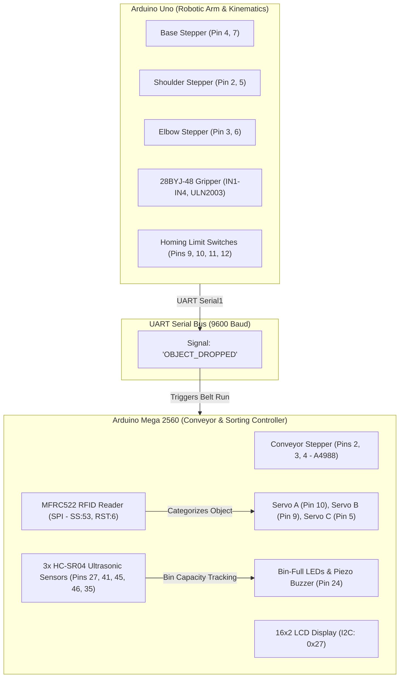

# 🤖 Automated Robotic Sorting System (Dual-Microcontroller Mechatronic Platform)

[](https://www.arduino.cc/)
[](https://isocpp.org/)
[-red.svg)](https://uom.lk/)
[](https://fit.uom.lk/)

An industrial-grade automated sorting conveyor platform featuring a **4-DOF Robotic Arm**, a **dual-microcontroller distributed architecture (Arduino Mega 2560 + Arduino Uno)**, **RFID-driven categorization**, and **ultrasonic feedback loop**. Built as part of the **Level 1 Hardware Project** at the Faculty of Information Technology, **University of Moratuwa**.

---

## 📌 System Architecture



---

## ⚙️ Key Technical Features

1. **Distributed Dual-Microcontroller Control:**
   * **Arduino Uno:** Executes inverse kinematics, homing sequences to mechanical limits, and precise pick-and-drop trajectories using 3 high-torque stepper motors and a geared stepper gripper.
   * **Arduino Mega 2560:** Controls the high-speed conveyor belt (A4988 driver), coordinates RFID identification, operates sorting diverter gates (MG995/MG996R servos), and monitors bin levels.
   * **Inter-board Communication:** Asynchronous UART serial protocol (`Serial1` @ 9600 baud) synchronizes robotic arm drops with conveyor indexing.

2. **Multi-Category RFID Sorting:**
   * Reads RFID tags on parts and dynamically sorts them into 3 distinct output compartments:
     * **Group A (`2E:7B:28:02` / `4C:8B:27:02`):** Triggers conveyor and opens Servo A diverter gate; monitored by Ultrasonic Sensor 3.
     * **Group B (`D5:CB:3C:02` / `73:68:3D:02`):** Triggers conveyor and opens Servo B diverter gate; monitored by Ultrasonic Sensor 1.
     * **Group C (`12:7C:3B:02` / `E6:5D:3D:02`):** Direct continuous conveyor pass-through; monitored by Ultrasonic Sensor 2.

3. **Closed-Loop Bin Monitoring & Safety:**
   * 3x HC-SR04 ultrasonic sensors calculate real-time fill level (`DETECTION_THRESHOLD = 8.0 cm`).
   * When any compartment reaches capacity (2 items), the system halts sorting, triggers the Piezo buzzer, illuminates warning LEDs, and displays `Group X Bin is Full!` on the 16x2 I2C LCD.

---

## 🛠️ Hardware Bill of Materials (BOM)

| Component | Specification | Quantity | Role |
| :--- | :--- | :--- | :--- |
| **Arduino Mega 2560** | 16MHz ATmega2560 | 1 | Master conveyor & sensor manager |
| **Arduino Uno** | 16MHz ATmega328P | 1 | Slave robotic arm kinematics controller |
| **Stepper Motors** | NEMA 17 / 28BYJ-48 | 4 | Base, Shoulder, Elbow, Conveyor, Gripper |
| **Stepper Drivers** | A4988 / ULN2003 | 4 | Motor current control & stepping |
| **Servo Motors** | TowerPro MG995 / MG996R | 3 | High-torque diverter sorting gates |
| **RFID Module** | RC522 (SPI) | 1 | Non-contact item categorization |
| **Ultrasonic Sensors**| HC-SR04 | 3 | Bin capacity & object tracking |
| **Display** | 16x2 LCD with I2C Backpack | 1 | Real-time status & diagnostic screen |
| **Limit Switches** | SPDT Microswitches | 4 | Arm calibration & origin homing |

---

## 📂 Project Repository Structure

```text
robotic-sorting-system/
├── src/
│   ├── mega_controller/
│   │   └── mega_controller.ino     # Conveyor, RFID, Servos, Ultrasonic & LCD logic
│   └── uno_robotic_arm/
│       └── uno_robotic_arm.ino     # 4-DOF Arm kinematics, Homing & Gripper control
├── docs/                           # Schematics, presentation slides & reports
├── README.md                       # Complete technical documentation
└── .gitignore                      # Standard Arduino / C++ ignores
```

---

## 🚀 How to Build and Deploy

### Required Libraries (Install via Arduino IDE Library Manager)
- `MFRC522` by GithubCommunity
- `LiquidCrystal_I2C` by Frank de Brabander
- `Servo` (Built-in Arduino library)
- `SPI` (Built-in Arduino library)

### Step 1: Uploading Uno Firmware
1. Open `src/uno_robotic_arm/uno_robotic_arm.ino` in Arduino IDE.
2. Select Board: **Arduino Uno** and your COM port.
3. Click **Upload**.

### Step 2: Uploading Mega Firmware
1. Open `src/mega_controller/mega_controller.ino` in Arduino IDE.
2. Select Board: **Arduino Mega or Mega 2560** and your COM port.
3. Click **Upload**.

### Step 3: Serial Communication Interconnect
* Connect **Arduino Uno TX (Pin 1)** to **Arduino Mega RX1 (Pin 19)** through a voltage divider or direct logic level.
* Connect **Arduino Uno GND** to **Arduino Mega GND** (Common ground is mandatory).

---

## 👨‍💻 Author & Academic Context
* **Developer:** **Sithum Manusha** ([GitHub](https://github.com/SithumManusha) | [LinkedIn](https://linkedin.com/in/sithum-manusha))
* **Institution:** Faculty of Information Technology, **University of Moratuwa (UoM)**
* **Program:** B.Sc. (Hons) in Information Technology & Management
* **Course:** Level 1 Hardware Project (Microcontroller-Based Application Development)
* **License:** This project is licensed under the [MIT License](LICENSE).

